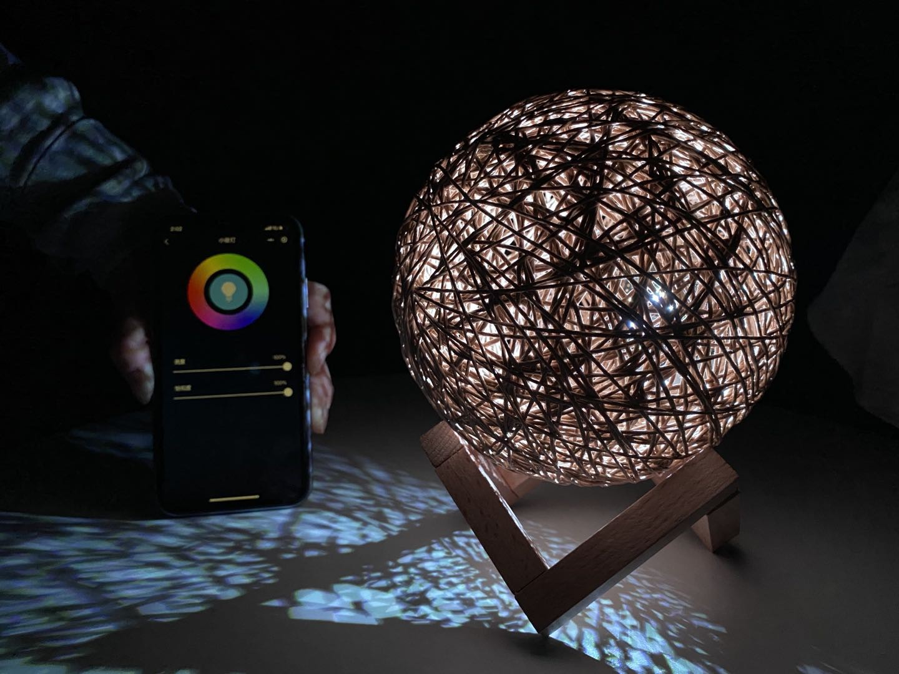
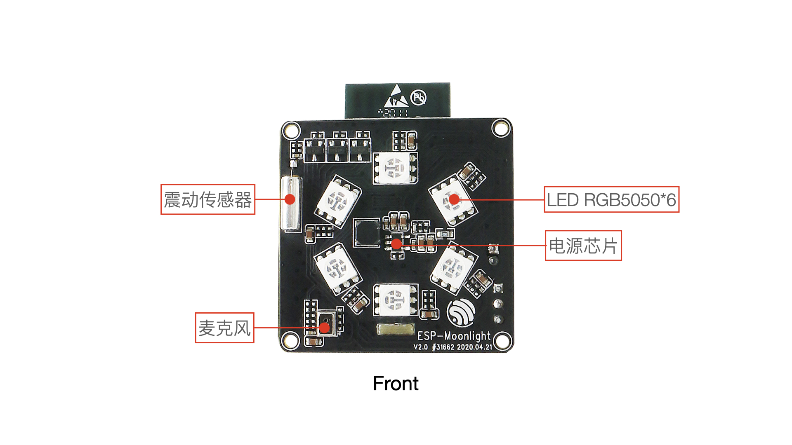
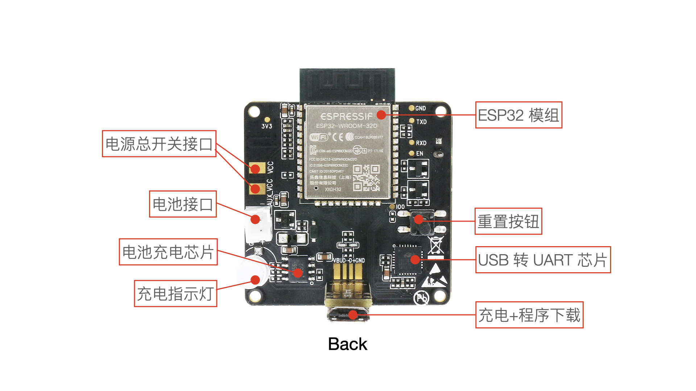

# ESP32-MoonLight

|  |
| ------------------------------------------------------------ |
|  |

ESP-Moonlight 是乐鑫推出的基于 ESP32 开发的月球灯示例项目，内含使用 ESP-IDF 开发的完整步骤。

## 概述

本项目以快速开发为特点，硬件结构简单，代码架构清晰完善，方便功能扩展，可实现驱动 LED 灯、局域网内使用小程序端控制灯的亮度和色彩等参数，可用于教育领域。

<table>
    <tr>
        <td ></td>
        <td ></td>
    </tr>
</table>

## 硬件

本项目使用的开发板为 ESP32-Moonlight ，集成了以下器件：

<table>
    <tr>
        <td >

</td>
        <td >

</td>
    </tr>
</table>

- [ESP32-Moonlight Schematic (PDF)](hardware/ESP-Moonlight_V2.0_N_XX_20200421_V0.3/01_Schematic/SCH_ESP-MOONLIGHT_V2_0_20200421A.pdf)

- 月球灯开发板具有以下功能：
  - 板载自动下载电路
  - 电池充电功能
  - 支持手机进行配网
  - 支持手机控制
  - 支持触碰控制
  - 支持OTA升级
  - 支持语音控制

## 文档

[入门指南](https://docs.espressif.com/projects/espressif-esp-moonlight/zh_CN/latest/gettingstarted.html)