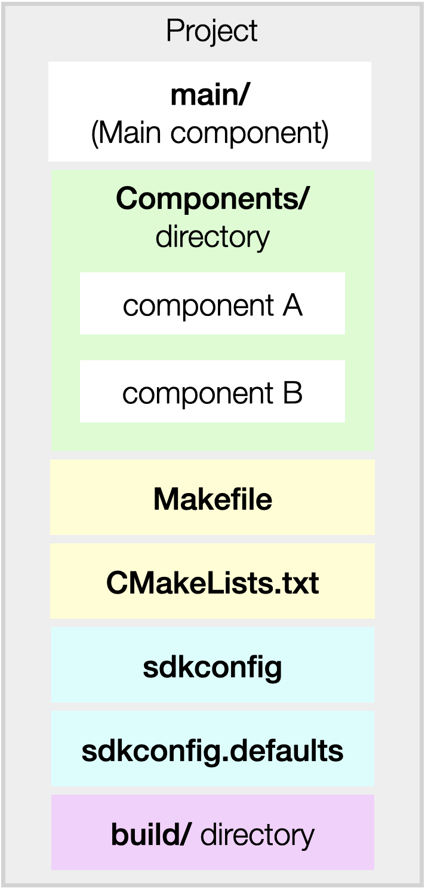

入门指南
===============

在本章中，我们将介绍 ESP32 的开发环境，并帮助您了解 ESP32 可用的开发工具和代码仓库。

开发过程概述
--------------------

使用 ESP32 开发产品时，常用的开发环境如下图所示：

.. figure:: ../_static/dev_setup.png
   :alt: Typical Developer Setup
   :align: center

   ESP32 产品开发过程

上图电脑（即开发主机）可以是 Linux、Windows 或 MacOS 操作系统。ESP32 开发板通过 USB 连接到开发主机，开发主机上有 ESP-IDF (乐鑫 SDK)、编译器工具链和项目代码。首先，主机编译代码生成可执行文件，然后电脑上的工具把生成的文件烧录到开发板上，开发版开始执行文件，最后你可以从主机查看日志。

准备工作
-------------

-  ESP32-Moonlight 开发板（也可以通过外接器件使用其他 ESP32 开发板）
-  USB 数据线
-  用于开发的 PC（Windows、Linux 或 Mac OS）

ESP-IDF 介绍
-------------

ESP-IDF 是乐鑫为 ESP32 提供的物联网开发框架。

-  ESP-IDF (Espressif IoT Development Framework) 是由乐鑫官方推出的针对 `ESP32 <https://www.espressif.com/en/products/hardware/socs>`_ 系列芯片的开发框架。除此之外，乐鑫还有用于音频开发的 ESP-ADF 和用于 MESH 网络开发的 ESP-MDF 等各种开发框架，全部开放在 `github <https://github.com/espressif>`_ 上。
-  ESP-IDF 包含一系列库及头文件，提供了基于 ESP32 构建软件项目所需的核心组件，还提供了开发和量产过程中最常用的工具及功能，例如：构建、烧录、调试和测量等。
-  ESP-IDF 支持在 Windows、Mac、Linux 多种操作系统下编译，在 V4.0 版本上除了安装编译环境时的差异之外几乎无差别，编译、烧录的操作都是一致的。

设置 ESP-IDF
~~~~~~~~~~~~~~

请参照 `ESP-IDF 入门指南 <https://docs.espressif.com/projects/esp-idf/zh_CN/release-v4.0/get-started/index.html>`_，按照步骤设置 ESP-IDF。注：请完成链接页面的所有步骤。

在进行下面步骤之前，请确认您已经正确设置了开发主机，并按照上面链接中的步骤构建了第一个应用程序。如果上面步骤已经完成，那让我们继续探索 ESP-IDF。

ESP-IDF 详解
~~~~~~~~~~~~~~
ESP-IDF 采用了一种基于组件的架构：

.. figure:: ../_static/idf_comp.png
   :alt: Component Based Design
   :align: center

   ESP-IDF 组件设计

ESP-IDF 中的所有软件均以“组件”的形式提供，比如操作系统、网络协议栈、Wi-Fi 驱动程序、以及 HTTP 服务器等中间件等等。在这种基于“组件”的架构下，你可以轻松使用更多自己研发或第三方提供的组件。

工程目录结构
~~~~~~~~~~~~~

开发人员通常借助 ESP-IDF 构建 *应用程序*，包含业务逻辑、外设驱动程序和 SDK 配置。

   应用程序架构

- `CMakeLists.txt` 和 `Makefile` 文件，用于控制工程的编译过程。
- `components` 文件夹，包含该项目的组件文件夹。
- `main` 文件夹，一个特殊的组件，默认编译这里面的代码，应用程序必须包含一个 **main** 组件。
- 一个可选的 *sdkconfig.defaults* 文件，存放应用程序默认的 SDK 配置。

在编译完成后会生成以下文件:

- `build` 文件夹，存放编译输出的文件。
- `sdkconfig` 文件，定义项目的所有配置。这个文件无需手动修改，编译时会自动从你在 menuconfig 中的设置来更新该文件。

.. note:: 更多关于工程结构和编译过程的细节，请参阅 `编程指南/构建系统 <https://docs.espressif.com/projects/esp-idf/zh_CN/v4.0/api-guides/build-system.html#component-directories>`_。

获取 ESP-Moonlight
---------------------

ESP-Moonlight 库包含了一系列由 ESP-IDF 构建的应用程序，我们将在本次练习中使用这些应用程序。首先克隆 ESP-Moonlight 库：

.. code:: shell

    $ git clone --recursive https://github.com/espressif/esp-moonlight

我们将构建一个可用的固件，因此选择使用 ESP-IDF 稳定版本进行开发。目前 ESP-Moonlight 使用的是 ESP-IDF V4.0 稳定版本，请切换到这一版本：

.. code:: shell

    $ cd esp-idf
    $ git checkout -b release/v4.0 remotes/origin/release/v4.0
    $ git submodule update --recursive

.. note::

    不同的版本之间会有一些差异，可能导致编译不通过等问题，关于如何选择 IDF 的版本参见 `ESP-IDF 版本简介 <https://docs.espressif.com/projects/esp-idf/zh_CN/v4.0/versions.html>`_。

现在，我们构建 ESP-Jumpstart 中的第一个应用程序 *Hello World*，并将其烧录到开发板上，具体步骤如下，相信您已经熟悉这些步骤：

.. code:: shell

    $ cd esp-moonlight/1_hello_world
    $ idf.py flash monitor

上面的步骤将编译生成一个应用程序。编译成功后，将会把生成的固件烧录到开发板。

烧录成功后，设备将重启。同时，你还可以在控制台看到该固件的输出。

代码
--------

现在，让我们研究一下 Hello World 应用程序的代码，位于 ``examples/1_hello_world``，它非常简单，包含了一些基本的程序功能:

.. code:: c

    void app_main()
    {
        int i = 0;
        while (1) {
            printf("[%d] Hello world!\n", i);
            i++;
            vTaskDelay(5000 / portTICK_PERIOD_MS);
        }
    }

下面是这组代码的一些要点：

-  ``app_main()`` 函数是应用程序入口点，FreeRTOS 一旦完成初始化，即将在 ESP32 的其中一个核上新建一个应用程序线程，称为主线程，并在这一线程中调用 ``app_main()`` 函数。这个就相当于众所周知的程序入口 `main` 函数。这个函数在 idf 中可以写成死循环操作，也可以在创建一些任务后返回。

-  printf()、strlen()、time() 等 C 库函数可以直接调用。IDF 使用 newlib C 标准库，newlib 是一个占用空间较低的 C 标准库，支持 stdio、stdlib、字符串操作、数学、时间/时区、文件/目录操作等 C 库中的大多数函数，不支持 signal、locale、wchr 等。在上面示例中，我们使用 printf() 函数将数据输出打印到控制台。

-  ``vTaskDelay()`` 函数是 FreeRTOS 操作系统提供的一个延时函数。FreeRTOS 是驱动 ESP32 双核的操作系统。`FreeRTOS <https://www.freertos.org>`_ 是一个很小的内核，提供了任务创建、任务间通信（信号量、信息队列、互斥量）、中断和定时器等机制。在上面示例中，我们使用 vTaskDelay 函数让线程休眠 5 秒。有关 FreeRTOS API 的详细信息，请查看 `FreeRTOS 文档 <https://www.freertos.org/a00106.html>`_。

未完待续
---------------

到现在为止，我们已经具备了基本的开发能力，可以进行编译代码、烧录固件、查看固件日志和消息等基本开发操作。从这里开始，我们已经成功运行了第一个程序，接下来就是一步一步完成更多的功能
