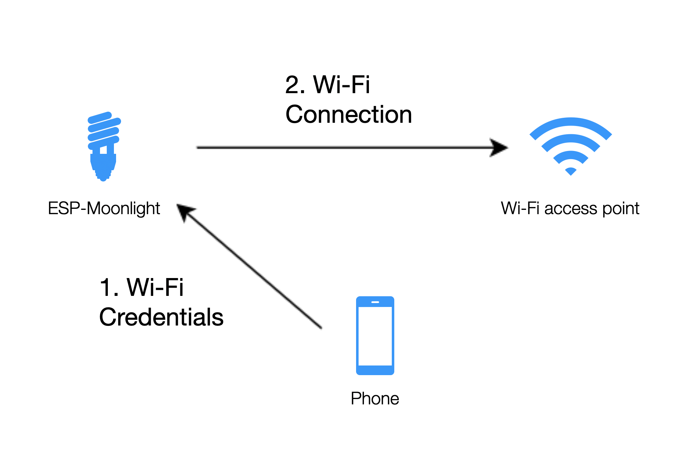

SoftAP 配网和 Bluetooth Low Energy 配网
========================================

在上个示例中有个很不方便的地方，我们把 Wi-Fi 信息（SSID 和 PASSWORD）直接固定写在了程序中，不能随时改变想要连接的 Wi-Fi，显然这样是不实用的。
所以出现了包括 SoftAP 配网、Bluetooth Low Energy 配网、smartconfig 等多种配网方式，允许用户在设备运行时，将其 Wi-Fi 信息配置到设备中。不同的方式各有优缺点，主要取决于应用场景。

由于用户的网络信息将永久储存在设备中，所以另外提供了 **恢复出厂设置** 功能，可擦除设备中储存的用户配置信息。如需查看相关代码，请前往 ``examples/4_network_config`` 目录。

概述
-------

如下图所示，在配网阶段，用户通常使用智能手机将 Wi-Fi 信息安全地配置到设备中。设备获取 Wi-Fi 信息后，就会连接到用户指定的 Wi-Fi 网络中。

    配网过程

配网方式
----------

- **SoftAP 配网**：ESP32 会建立一个 Wi-Fi 热点，用户将手机连接到这个热点后将要连接的 Wi-Fi 信息发送给 ESP32。这种配网模式需要用户手动连接到 ESP32 的热点网络，这会让用户感到奇怪和不友好，不过这种方式很可靠，设备端的代码也简单。

- **Bluetooth Low Energy 配网**：ESP32 会进行 Bluetooth Low Energy 广播，附近的手机收到该广播后会询问用户是否进行 Bluetooth Low Energy 连接，如选择连接，则手机即可将信息发送给 ESP32。在这个的过程中用户无需切换 Wi-Fi 网络，但是需要打开蓝牙，用户体验相对 SoftAP 配网好一些。但是，需要在设备端加入蓝牙相关代码，这会增加固件的大小，并在配网完成前占用一定内存。

- **Smartconfig 配网**：这种方式不需要建立任何通信链路，手机端通过发送不同长度的 UDP 广播包来表示 Wi-Fi 信息，ESP32 在混杂模式监听信号覆盖范围内的所有数据帧，通过一定算法得到 Wi-Fi 信息。缺点是配网成功率受环境的影响较大。

- **WEB 配网**：在 ESP32 上建立热点，使用手机连接上后在浏览器打开配置网页，在网页中完成配网，这种方式很可靠，而且允许在电脑端完成配网，缺点是需要在设备端占用空间来嵌入网页。

BluFi 配网
----------

在本节的例程中使用的是 Bluetooth Low Energy 的配网方式，ESP32 上提供了一个完整的解决方案——BluFi。它是一个基于蓝牙通道的 Wi-Fi 网络配置功能，通过安全协议将 Wi-Fi 配置和证书传输到 ESP32，然后 ESP32 可基于这些信息连接到 AP 或建立 SoftAP。

Blufi 是完全开源的，以下为相关下载链接：

* `BluFi 协议 <https://docs.espressif.com/projects/esp-idf/en/latest/api-guides/blufi.html?highlight=blufi#the-frame-formats-defined-in-blufi>`_
* `iOS 源码 <https://github.com/EspressifApp/EspBlufiForiOS>`_
* `Android 源码 <https://github.com/EspressifApp/EspBlufi>`_

你可以从 `Android version <https://github.com/EspressifApp/EspBlufiForAndroid/releases>`_ 和 `iOS version <https://itunes.apple.com/cn/app/espblufi/id1450614082?mt=8>`_ 下载手机端 APP 来进行配置。

.. note::

    目前的 IOS 和 Android 的 APP 使用逻辑因为系统的权限等原因而不尽相同，在未来的版本上可能会统一起来。

代码
~~~~~~~
BluFi 的使用非常简单，下面是主程序部分的代码：

.. code-block:: c
 
    /**< Initialize the BluFi */
    blufi_init();

    ESP_LOGI(TAG, "Wait for connect");
    blufi_wait_connect();

:c:func:`blufi_init` 进行 BluFi 的初始化，:c:func:`blufi_wait_connect` 函数则一直等待配网完成。
在 `components/blufi` 文件夹中存放了 BluFi 的相关代码。

这里给出一些工程中新增文件的作用：

- ``components/blufi/blufi.c``：关于 BluFi 的应用代码。
- ``components/blufi/blufi_security.c``：关于 BluFi 安全加密相关。
- ``sdkconfig.default``：保存了项目的默认配置，用于指定某些配置项。
- ``partitions.csv``：ESP32 flash 的分区表，默认的分区表中留给 factory 应用程序的空间对于本节程序是不足的，自定义的分区表将 factory 分区增大到了 2 MB。

Wi-Fi 信息的存储
-------------------------------

我们希望在进行配网后，设备接收到的网络信息保存起来，以便下次直接读取出来进行连接，这里使用 NVS 进行保存。NVS(Non-volatile storage) 是一种软件组件，用于永久储存键值对，即便设备重启或断电，这些信息也不会丢失。NVS 在 flash 中有一个专门的分区来储存这些信息。 

NVS 经过专门设计，不但可以防止设备断电带来的数据损坏影响，而且还可以通过将写入的内容分布到整个 NVS 分中以处理 flash 磨损的问题。请参考 `NVS 相关文档 <https://docs.espressif.com/projects/esp-idf/en/release-v4.0/api-reference/storage/nvs_flash.html>`_，查看详细信息。

默认情况下，Wi-Fi 组件会自动帮我们在 NVS 中保存上一次连接的 Wi-Fi 信息，但是如果调用函数 `esp_wifi_set_storage(WIFI_STORAGE_RAM)` 将 Wi-Fi 信息保存到了 RAM 中，则掉电丢失该信息。当然我们也可以自己使用 NVS 的相关函数来实现存储包括 Wi-Fi 信息在内的自己的信息。

恢复出厂设置
~~~~~~~~~~~~~~

当我们想要重新进行配网时，*恢复出厂设置* 便是一个常见需要。通常而言，长按设备上的某个按钮即可恢复出厂设置。

在应用程序中，我们通过长按按钮动作来恢复出厂设置，下面是按键配置的程序：

.. code-block:: c

    static void configure_push_button(int gpio_num)
    {
        button_handle_t btn_handle = iot_button_create(gpio_num, 0);

        if (btn_handle) {
            iot_button_add_on_press_cb(btn_handle, 3, button_press_3sec_cb, NULL);
        }
    }

在成功创建了一个按键驱动后添加了一个长按的动作回调函数，一旦按钮被按下超过 3 秒，就会回调 :c:func:`button_press_3sec_cb` 函数。

回调函数内容如下：

.. code:: c

    static void button_press_3sec_cb(void *arg)
    {
        ESP_LOGW(TAG, "Restore factory settings");
        nvs_flash_erase();
        esp_restart();
    }

这段代码的作用是擦除 NVS 的所有内容，然后触发设备重启。由于 NVS 内容已被清除，设备下次启动时将回到未配置状态。

演示
--------

在 ESP-MoonLight 提供的微信小程序中集成了配网功能，扫描下面二维码进入：

.. figure:: ../_static/wechat_mini.jpg
    :alt: Wechat Mini
    :align: center

    微信小程序二维码

微信小程序的源码可在 `https://github.com/EspressifApps/Moonlight <https://github.com/EspressifApps/Moonlight>`_ 查看。

- 上电等待 10 秒的时间用之前保存的 Wi-Fi 信息进行自动连接，此时 LED 是黄色呼吸灯状态。

- 如果自动连接成功则 LED 直接高亮并开始颜色渐变，配网结束；如果未连接则启动 BluFi 并保持呼吸灯状态。 

- 使用手机进行配网，这里有两种可选方式：

  + 打开手机 APP 扫描设备后配置网络。有关如何配网的详细介绍，可参阅 `ESP32 蓝牙配⽹用户指南 <https://www.espressif.com/sites/default/files/documentation/esp32_bluetooth_networking_user_guide_cn.pdf>`_。
  + 使用微信小程序，按照提示步骤进行配网。

- ESP32 按照接收到的 Wi-Fi 信息进行连接，成功后 LED 高亮并开始颜色渐变，代表配网完成。

- 如果此时重启设备，设备将不再进入网络配置模式，而是直接连接已配置的 Wi-Fi 网络。这就是我们想要的效果。

- 这里，如果想重新配置你的设备，可尝试长按按钮（3 秒以上），你可以看到恢复出厂设置的整个过程。

未完待续
---------------

目前，我们已经有了这样一个通过手机 app 连入家庭 Wi-Fi 网络的月球灯，并且网络配置的过程已经很方便了。下一步，我们会将连网和自身的功能结合起来，远程控制灯的状态。

