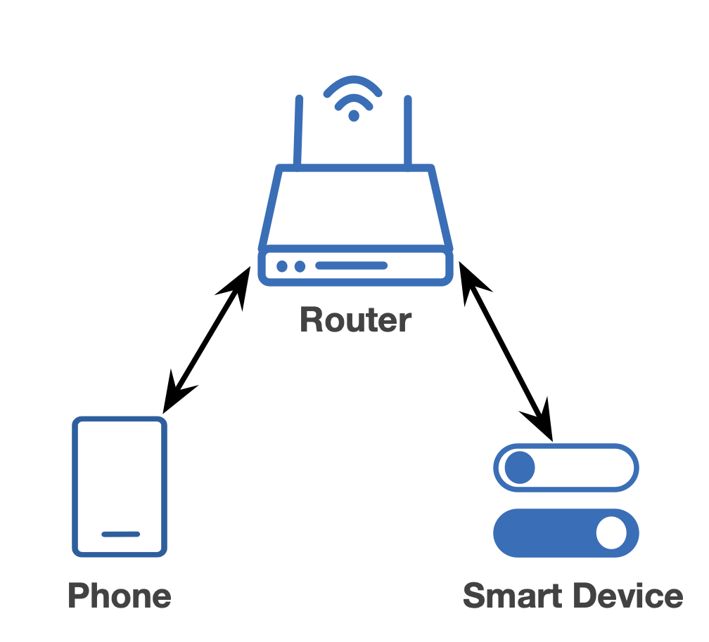
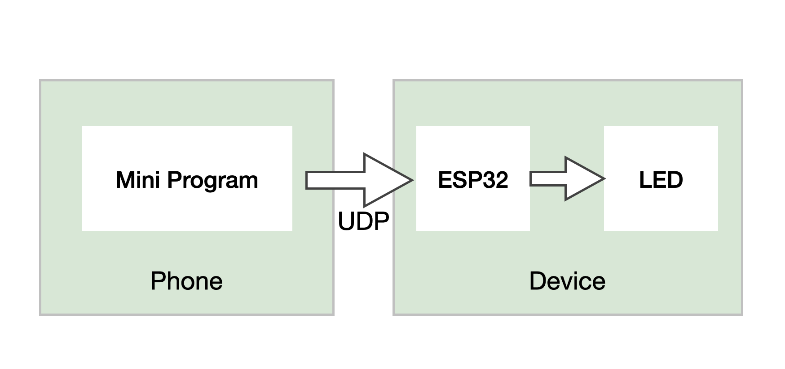

远程控制（局域网）
======================

要想成为一个智能硬件，单纯的连网是不够的。真正的智能在于通过联网对设备进行远程控制或监测，然后依托于强大的云服务，赋予设备一定的智慧。
在本章中，我们先将月球灯在局域网内连接到手机，实现对设备的控制。如需查看相关代码，请前往 ``examples/5_app_control`` 目录。

通信连接方式
--------------

首先需要确定使用何种连接方式，下面提供了几种方式：

1. 将设备接入云，手机通过云平台的 API 来进行控制，如下图

.. figure:: ../_static/cloud_connectivity.png
    :width: 700
    :alt: Cloud Connectivity
    :align: center

    云连接

这种方式需要一个设备云服务器，这样不仅允许手机的远程控制，还允许通过其他的云来透过设备云控制设备，具有极大的灵活性。

2. 设备在局域网内连接，不经过外网，如下图

    局域网连接

相比之下，这种在局域网内的连接方式简单了许多，但同时也限制了控制只能在该局域网下进行。如果手机离开了该网络，则无法控制我们的设备，因为 Wi-Fi 覆盖范围有限，这样的断连情况较为常见。

通信过程
---------

简单起见，这里我们选用第二种方式并且使用 UDP 进行通信，使 ESP32 设备端作为 UDP Server，手机作为 Client 端，手机上使用微信小程序作为控制端。
当在微信小程序中点击颜色块时，手机会以 UDP 广播的方式发送 JSON 数据包，ESP32 接收到数据后进行解析，将得到的颜色值发送给 LED 灯。

    通信过程

数据格式
~~~~~~~~~~

数据使用 JSON 格式，如下所示:

.. code-block:: JSON

    {
        "led":{
            "red":255,
            "green":255,
            "blue":255
        }
    }

其中 red、green、blue 分别控制着红、绿、蓝三色的亮度，其范围值都是 0 ~ 255。

代码
-------

以下所示为 UDP 通信的部分代码：

.. code-block:: c
    :linenos:

    if (addr_family == AF_INET) {
        struct sockaddr_in *dest_addr_ip4 = (struct sockaddr_in *)&dest_addr;
        dest_addr_ip4->sin_addr.s_addr = htonl(INADDR_ANY);
        dest_addr_ip4->sin_family = AF_INET;
        dest_addr_ip4->sin_port = htons(PORT);
        ip_protocol = IPPROTO_IP;
    }

    int sock = socket(addr_family, SOCK_DGRAM, ip_protocol);

    if (sock < 0) {
        ESP_LOGE(TAG, "Unable to create socket: errno %d", errno);
        break;
    }

    ESP_LOGI(TAG, "Socket created");

    int err = bind(sock, (struct sockaddr *)&dest_addr, sizeof(dest_addr));

    if (err < 0) {
        ESP_LOGE(TAG, "Socket unable to bind: errno %d", errno);
    }

    ESP_LOGI(TAG, "Socket bound, port %d", PORT);

    while (1) {

        ESP_LOGI(TAG, "Waiting for data");
        struct sockaddr_in6 source_addr; /**< Large enough for both IPv4 or IPv6 */
        socklen_t socklen = sizeof(source_addr);
        int len = recvfrom(sock, rx_buffer, sizeof(rx_buffer) - 1, 0, (struct sockaddr *)&source_addr, &socklen);

        /**< Error occurred during receiving */
        if (len < 0) {
            ESP_LOGE(TAG, "recvfrom failed: errno %d", errno);
            break;
        }
        /**< Data received */
        else {
            /**< Get the sender's ip address as string */
            if (source_addr.sin6_family == PF_INET) {
                inet_ntoa_r(((struct sockaddr_in *)&source_addr)->sin_addr.s_addr, addr_str, sizeof(addr_str) - 1);
            } else if (source_addr.sin6_family == PF_INET6) {
                inet6_ntoa_r(source_addr.sin6_addr, addr_str, sizeof(addr_str) - 1);
            }

            rx_buffer[len] = 0; /**< Null-terminate whatever we received and treat like a string... */
            ESP_LOGI(TAG, "Received %d bytes from %s:", len, addr_str);

            cJSON *root = cJSON_Parse(rx_buffer);

            if (!root) {
                printf("JSON format error:%s \r\n", cJSON_GetErrorPtr());
            } else {
                cJSON *item = cJSON_GetObjectItem(root, "led");
                int32_t red = cJSON_GetObjectItem(item, "red")->valueint;
                int32_t green = cJSON_GetObjectItem(item, "green")->valueint;
                int32_t blue = cJSON_GetObjectItem(item, "blue")->valueint;
                cJSON_Delete(root);

                if (red != g_red || green != g_green || blue != g_blue) {
                    g_red = red;
                    g_green = green;
                    g_blue = blue;
                    ESP_LOGI(TAG, "Light control: red = %d, green = %d, blue = %d", g_red, g_green, g_blue);
                    ESP_ERROR_CHECK(g_leds->set_rgb(g_leds, g_red, g_green, g_blue));
                }
            }
        }
    }

- 1 ～ 26 行为 UDP 的通信配置过程

- 在循环中不断调用 :c:func:`recvfrom` 来接收数据

- 将接收到的数据使用 :c:func:`cJSON_Parse` 进行解析得到 LED 灯的颜色值

- 最后用解析出的颜色值去控制 LED 灯

.. note::

    为了确保通信的可靠性，微信小程序在发送 UDP 广播时，会重复发送多次。

未完待续
---------------

通过这个应用程序，我们将月球灯本身的功能与网络连接功能结合到了一起，实现了一个简单的远程控制。云端的控制我们将在以后介绍。下一章，我们会探讨连网设备的一个常见功能：空中固件升级。
